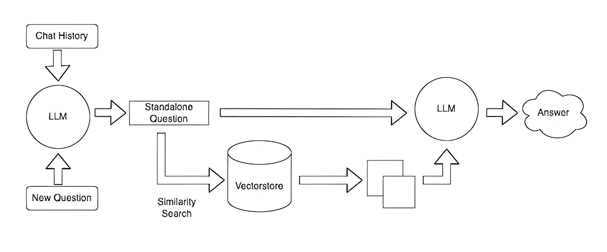
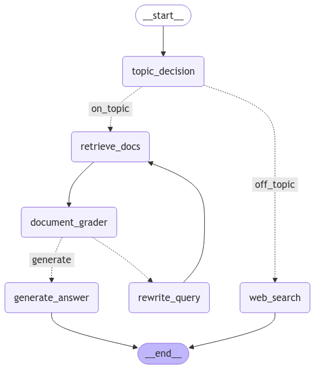

---

A lightweight, retrieval-augmented assistant for medical Q\&A, now extended with a research-focused LLM bias analysis on Antarctic ice-melting debates.

## 🚀 Project Overview

This repository contains two related components:

1. **Agentic RAG Medical Assistant**
   A history-aware medical chatbot built on a fine-tuned LLaMA-3.1-8B model with an agentic RAG (Retrieval-Augmented Generation) pipeline for precise, context-rich answers.
2. **Climate-Bias LLM Analysis**
   An independent research project to explore bias in LLMs when fed two contrasting “sides” of scientific literature on Antarctic ice-sheet melting (global warming vs. natural cycle).

---

## 📝 Problem Statement

**How can we quantify and mitigate bias in LLMs when they are trained on conflicting scientific viewpoints?**

* **Side A**: Antarctic ice melt driven by anthropogenic greenhouse gas emissions
* **Side B**: Antarctic ice melt driven by a natural melt-refreeze cycle
* **Goal**: Train separate and combined LLMs on curated research-paper datasets, then evaluate how “controversial” prompts influence model output bias.

---

## 📂 Contents

* **`medical-assistant/`** — Agentic RAG pipeline, FastAPI backend, LoRA-fine-tuned LLaMA model
* **`bias-analysis/`** — Scripts, notebooks, and configs for training & evaluating the Climate-Bias LLMs
* **`docs/`** — Architecture diagrams, screenshots, and design docs

---

## 🔖 Badges

[](https://www.python.org/)
[](https://fastapi.tiangolo.com/)
[](LICENSE)
[](https://huggingface.co/Rohanpatil02/FineTunedBias)
[](https://huggingface.co/datasets/Rohanpatil02/DatasetBiasMergedCSV)

---

## 🏗 Agentic RAG Medical Assistant

### Architecture

<p align="center">
  
  &nbsp;&nbsp;
  
</p>

### Key Features

* 🧠 **History-Aware**: Maintains conversational context across turns
* 🕵️ **Intelligent Routing**: Agents decide when to invoke web search (e.g., Wikipedia) vs. domain retrieval
* 📄 **Relevance Grading**: Scores documents for RAG retrieval; rewrites queries if needed
* ⚡ **Low-Latency**: FastAPI + async I/O to reduce response times by \~40%
* 📈 **Performance**: Fine-tuned LLaMA-3.1-8B via LoRA; **ROUGE-1 = 0.29** on held-out medical QA

### Tech Stack

| Component           | Technology                                           |
| ------------------- | ---------------------------------------------------- |
| **LLM Fine-Tuning** | LLaMA-3.1-8B + PEFT (LoRA) + 4-bit QLoRA via Unsloth |
| **RAG Framework**   | LangChain + ChromaDB embeddings                      |
| **API Backend**     | FastAPI                                              |
| **Model Hosting**   | Ollama + Hugging Face (GGUF)                         |

### Setup & Run

```bash
# 1. Clone
git clone https://github.com/SathvikNayak123/Agentic-RAG.git
cd Agentic-RAG

# 2. Install
pip install -r requirements.txt

# 3. Prepare data & embeddings
#    - Populate `medical-docs/`
#    - python scripts/generate_embeddings.py

# 4. Pull fine-tuned model
ollama pull hf.co/Rohanpatil02/llama3-ChatDoc

# 5. Launch server
uvicorn app:app --reload
```

---

## 🔍 Climate-Bias LLM Analysis

### Project Goal

1. **Data Preparation**

   * Collate Side A & Side B research papers into merged CSV.
   * Create prompt templates for unbiased, biased, and controversial queries.

2. **Model Training**

   * Train separate LoRA-fine-tuned LLaMA models on each side.
   * Train a combined model on both sides.

3. **Bias Evaluation**

   * Construct “controversial” prompts (e.g., “Is Antarctic ice melt primarily…?”).
   * Measure divergence in output distributions and sentiment/polarity.
   * Quantify bias via metrics (e.g., JSD, ROI, sentiment score delta).

### Resources & Links

* **Fine-Tuned Model**:
  🔗 [https://huggingface.co/Rohanpatil02/FineTunedBias](https://huggingface.co/Rohanpatil02/FineTunedBias)
* **Merged Dataset**:
  🔗 [https://huggingface.co/datasets/Rohanpatil02/DatasetBiasMergedCSV](https://huggingface.co/datasets/Rohanpatil02/DatasetBiasMergedCSV)
* **Prompt Templates**:
  🔗 [https://huggingface.co/datasets/Rohanpatil02/DatasetPrompts](https://huggingface.co/datasets/Rohanpatil02/DatasetPrompts)

### How to Get Started

1. **Clone & Install**

   ```bash
   git clone https://github.com/YourUser/Agentic-RAG.git
   cd bias-analysis
   pip install -r requirements.txt
   ```

2. **Inspect Data**

   ```bash
   python scripts/inspect_data.py \
     --dataset Rohanpatil02/DatasetBiasMergedCSV
   ```

3. **Fine-Tune Models**

   ```bash
   # Side A only
   python train.py \
     --model llama-3.1-8b \
     --data DatasetBiasMergedCSV \
     --side A \
     --output FineTunedBias-A

   # Side B only
   python train.py --side B --output FineTunedBias-B

   # Combined
   python train.py --side AB --output FineTunedBias-AB
   ```

4. **Evaluate Bias**

   ```bash
   python evaluate_bias.py \
     --models FineTunedBias-A FineTunedBias-B FineTunedBias-AB \
     --prompts DatasetPrompts/controversial.jsonl \
     --metrics jsd sentiment
   ```

5. **Analyze Results**

   * Review logs in `results/`
   * Generate visualizations: `python scripts/plot_bias.py`

---

## 📚 References & Acknowledgments

* [LLaMA 3.1 Paper](https://arxiv.org/abs/xxxx.xxxxx)
* [LangChain Documentation](https://langchain.readthedocs.io)
* [PEFT (LoRA) Guide](https://github.com/huggingface/peft)
* Thanks to Prof. Adnan Rakin for guidance on bias-mitigation research.

---

## ⚖️ License

MIT © 2024 Rohan Patil

---

> “Science progresses one bias at a time.” 🚀
