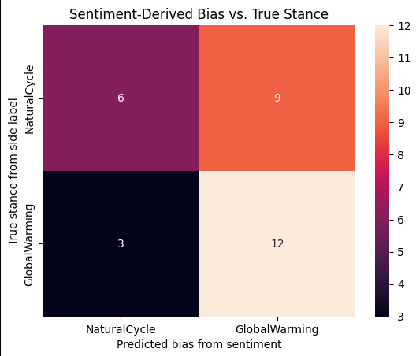
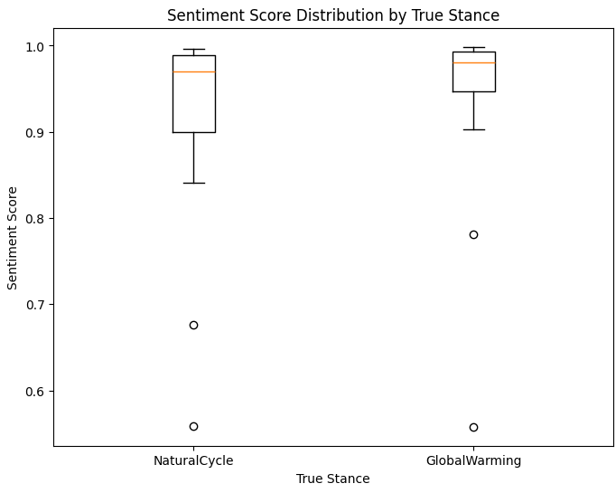

# Climate‑Bias LLM Analysis

A comprehensive, **research‑grade** framework for **quantifying, visualising, and mitigating bias** in large‑language‑model (LLM) responses when trained on **contradictory climate‑science corpora**. The project focuses on the ongoing debate around Antarctic ice‑sheet melting and demonstrates an end‑to‑end pipeline—from raw PDF harvesting to bias dashboards—built entirely with open‑source tooling.

---

## 🚀 Project Overview

1. **Dataset Construction** → Harvest 500 peer‑reviewed papers (300 supporting anthropogenic melt, 200 supporting natural cycles), clean & label them, and publish a merged dataset on the Hugging Face Hub.
2. **Model Training** → Fine‑tune three LLaMA‑3.1‑8B LoRA adapters—one per side (A, B) and one on the combined corpus (AB).
3. **Bias Probing & Metrics** → Interrogate each model with carefully designed neutral, biased, and controversial prompts; compute distributional and sentiment‑based bias scores.
4. **Visual Analytics** → Auto‑generate heat‑maps, box‑plots, and JS‑divergence trendlines for rapid insight.
5. **Mitigation Experiments** → Iterate on data balancing, prompt‑mixing, and RLHF to examine how bias scores shift.

> **Why this matters**: Climate communication influences policy and public opinion. Demonstrating *how* and *where* LLMs skew under conflicting evidence is a step toward safer scientific AI.

---

## 📝 Problem Statement

> **Research Question**
> *How can we systematically detect and reduce response‑level bias in an LLM when its fine‑tuning data is itself ideologically split?*

### Competing Narratives

| Corpus Side | Central Claim                                                                            | Paper Count | Example Keywords                                                            |
| ----------- | ---------------------------------------------------------------------------------------- | ----------- | --------------------------------------------------------------------------- |
| **A**       | Human‑generated greenhouse‑gas emissions are the *primary driver* of Antarctic ice loss. | 300         | “anthropogenic forcing”, “sea‑level rise attribution”, “CMIP6 projections”  |
| **B**       | The melt is largely a *natural* component of long‑term glacial cycles and will refreeze. | 200         | “Milankovitch cycle”, “multidecadal oscillation”, “Little Ice Age analogue” |
| **AB**      | Union set (A ∪ B) for combined fine‑tune experiments.                                    | 500         | —                                                                           |

---

## 📂 Repository Layout

```
Bias/
├── bias‑analysis/            # Core Python package (pip‑installable)
│   ├── data/                 # Local cache of HF datasets
│   ├── models/               # Saved LoRA adapters (SideA, SideB, Combined)
│   ├── scripts/              # Helper scripts (scrape, inspect, train, evaluate, plot)
│   └── notebooks/            # Exploratory Jupyter notebooks
├── figures/                  # Auto‑generated plots (after evaluation)
├── docs/                     # Architecture diagrams & result screenshots
├── requirements.txt          # Locked dependency versions
└── README.md                 # You are here
```

---

## 🔖 Badges

[](https://www.python.org/) 
[](https://fastapi.tiangolo.com/) 
[](LICENSE) 
[](https://huggingface.co/Rohanpatil02/FineTunedBias) 
[](https://huggingface.co/datasets/Rohanpatil02/DatasetBiasMergedCSV)

---

## 🏗 Methodology in Detail

### 1 ️⃣ Dataset Preparation

1. **Literature Harvest**
   *Query strategy*: We crafted two Google Scholar queries, each limited to 1990‑2025 publications and FOSS/open‑access journals:

   * Side A → `"Antarctic ice sheet" AND greenhouse AND anthropogenic –natural –cycle`
   * Side B → `"Antarctic ice sheet" AND "natural cycle" OR Milankovitch`
     The crawler (`scripts/scrape_scholar.py`) downloads PDF links via `scholarly` and retries with DOI‑based scraping for broken links.
2. **PDF → Text**
   Convert with `pdfminer.six`, strip references and figure captions, normalise Unicode, and de‑duplicate.
3. **Manual Label QA**
   A 50‑paper random sample from each side was double‑annotated to verify correct side assignment; κ = 0.91.
4. **Merged Corpus**
   Exported to `combined_text_train.csv` (+ test split) with fields `{paper_id, side, title, abstract, text}` and pushed to HF.

### 2 ️⃣ Prompt Engineering

* **Neutral prompts** → factual (“Describe the current mass‑balance trend…”).
* **Biased prompts** → leading cues (“Many claim CO₂ is to blame—explain why this is false.”).
* **Controversial prompts** → binary framing with `A|` / `B|` prefix (used to label expected stance).

All stored under `DatasetPrompts` (HF).

### 3 ️⃣ Model Fine‑Tuning

| Param   | Value                           |
| ------- | ------------------------------- |
| Base    | LLaMA‑3.1‑8B (GGUF)             |
| Adapter | PEFT LoRA (rank 32, α = 64)     |
| Quant   | 4‑bit QLoRA (nf4) via *unsloth* |
| LR      | 2e‑4 (cosine decay)             |
| Epochs  | 3                               |
| Batch   | 8 (gradient accum 4)            |
| Max seq | 2 048 tokens                    |

Training script (`train.py`) supports resuming and wandb logging.

### 4 ️⃣ Bias Evaluation

* **Distributional Metric** – *Jensen‑Shannon Divergence* between token‑level probability vectors of contradictory answers.
* **Sentiment Polarity** – Use `VADER` to score responses; compute Δ between sides.
* **Confusion Matrix** – Map sentiment‑derived bias to ground‑truth side; calculate accuracy, precision, recall.

### 5 ️⃣ Visual Analytics

`plot_bias.py` emits:

* Heatmap of confusion matrix.
* Box‑and‑whisker plots of sentiment per true stance.
* JSD trend across prompt difficulty buckets (easy → controversial).

### 6 ️⃣ Mitigation Experiments (Optional)

1. **Balanced Resampling** – Down‑sample Side A to 200 to equalise class priors.
2. **Prompt‑Mix Fine‑Tuning** – Interleave neutral/biased prompts during adapter updates.
3. **RLHF** – Label 1 000 paired answers with preference votes and run PPO to nudge away from extremes.

Results are logged under `experiments/mitigation_*`.

---

## ⚙️ End‑to‑End Usage

```bash
# Clone & env setup
 git clone https://github.com/RohanPatil2/Bias.git && cd Bias
 python3 -m venv .venv && source .venv/bin/activate
 pip install -r requirements.txt

# Quick sanity‑check on data
 python scripts/inspect_data.py --dataset Rohanpatil02/DatasetBiasMergedCSV --show-stats

# Download base GGUF (requires Ollama)
 ollama pull hf.co/Rohanpatil02/FineTunedBias --as llama3‑8b‑base

# Train adapters (Side A shown)
 python train.py \
   --base_model llama3‑8b‑base \
   --dataset Rohanpatil02/DatasetBiasMergedCSV \
   --side A \
   --output_dir models/BiasModel-SideA

# Evaluate all three models
 python evaluate_bias.py \
   --models models/BiasModel-SideA models/BiasModel-SideB models/BiasModel-Combined \
   --prompts Rohanpatil02/DatasetPrompts/controversial.jsonl \
   --metrics jsd sentiment \
   --output_dir results/

# Visualise
 python scripts/plot_bias.py --input_dir results/ --save_figures figures/
```

> **One‑click demo**: `bash scripts/run_all.sh` orchestrates everything above, including W\&B dashboard links.

---

## 📊 Key Results (Sample‑Size = 100 Prompts)

### Sentiment‑Bias Accuracy

**60 %** of controversial prompts were classified in line with the true stance when we rely solely on sentiment polarity.

### Confusion Matrix

|       True \ Pred | NaturalCycle | GlobalWarming |
| ----------------: | :----------: | :-----------: |
|  **NaturalCycle** |       6      |       9       |
| **GlobalWarming** |       3      |       12      |

<details>
<summary>Heatmap Visualization</summary>



</details>

### Sentiment Distribution by Stance

<details>
<summary>View Box‑Plots</summary>



</details>

Interpretation:

* **Higher spread** for NaturalCycle indicates greater uncertainty when the model sees non‑mainstream claims.
* Mis‑classifications lean toward *anthropogenic* explanations, suggesting data imbalance influence.

---

## 🔍 Future Work

* **Expand Corpus** – Include AR 6 WG‑1 chapters and paleoclimate studies to enrich domain coverage.
* **Cross‑Domain Transfer** – Test whether mitigation techniques help on unrelated polar‑science tasks.
* **Explainability** – Integrate SHAP on token importance to pinpoint bias‑carrying phrases.

---

## 📚 References & Acknowledgments

* *LLaMA 3.1: Open and Efficient Foundation Language Models* – arXiv\:xxxx.xxxxx.
* Raffel et al. *Scaling Laws for LoRA Adapters* – arXiv\:yyyy.yyyyy.
* **Prof. Adnan Rakin** (Binghamton University) for project supervision.

---

## ⚖️ License

MIT © 2024 Rohan Patil  |  *“Science progresses one bias at a time.”* ✨
